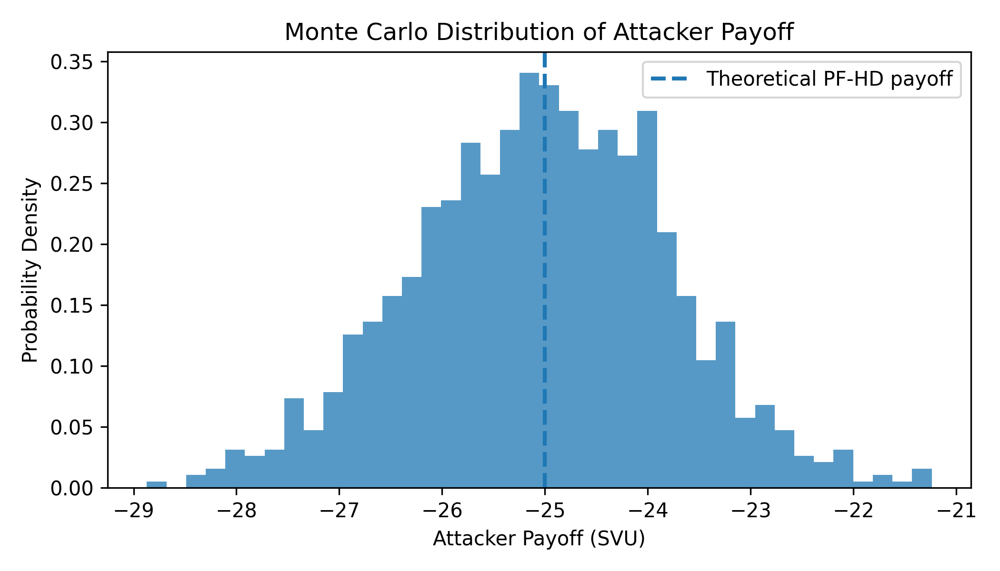
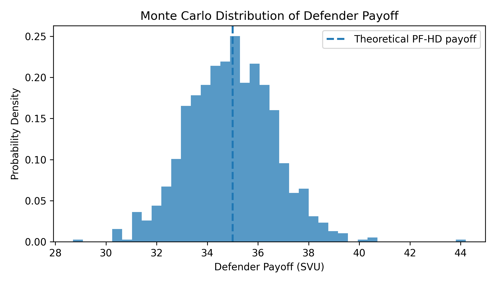
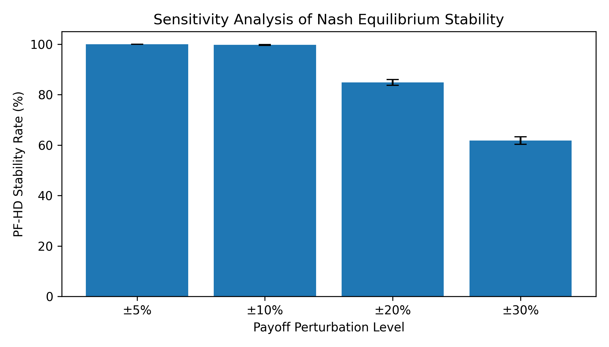
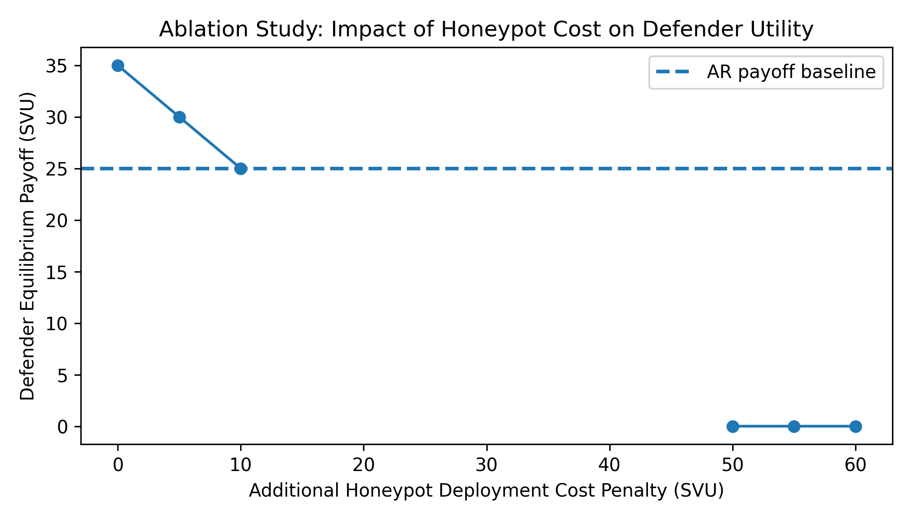

This repository contains the implementation and reproducibility artifacts for:

**Game-Theoretic Modeling of APT Lateral Movement Defense**  
Keerthana Bhukya, Harman Bath  
University of the Pacific  

[View Full Paper](paper/main.pdf)

Overview
Advanced Persistent Threat (APT) attacks often succeed not at entry, but during **lateral movement**, where attackers escalate privileges and navigate internal systems toward critical assets.

This project models attacker–defender interaction as a **two-player non-cooperative game**, analyzing whether **deception-based defenses (honeypots)** remain effective under varying real-world economic conditions.

The work combines **game theory, cybersecurity economics, and simulation** to evaluate strategic defense decisions.

 Key Contributions
- Designed a **game-theoretic model** for APT lateral movement
- Calibrated payoffs using **multiple real-world datasets** (IBM, Mandiant, Verizon, Ponemon)
- Identified a stable **Nash equilibrium: (Persistence First, Honeypot Deployment)**
- Demonstrated **honeypot deployment as a dominant defender strategy**
- Built **Monte Carlo simulations** to validate robustness under uncertainty
- Performed **sensitivity and ablation analysis** to evaluate model stability
- Mapped theoretical insights to **practical enterprise security architecture**

 Key Results
- **Consistent equilibrium across all datasets**
- **99.4% stability** under stochastic perturbation
- Significant improvement in **defender utility using deception strategies**
- Robust performance under **±20% uncertainty in cost assumptions**

 Project Structure
```
apt-game-theory-defense/
│
├── README.md
├── requirements.txt
├── paper/
│   └── main.pdf
│
├── src/
│   ├── payoff_matrices.py
│   ├── nash_solver.py
│   ├── monte_carlo.py
│   ├── sensitivity_analysis.py
│   ├── ablation_study.py
│
├── figures/
│   ├── montecarlo.png
│   ├── defender_montecarlo.png
│   ├── sensitivity.png
│   ├── ablation_honeypot_cost.png
```

 How to Run

Install dependencies:
```bash
pip install -r requirements.txt
```

Run experiments:
```bash
python src/nash_solver.py
python src/monte_carlo.py
python src/sensitivity_analysis.py
python src/ablation_study.py
```

 Visual Results

### Monte Carlo Distribution


### Defender Payoff Distribution


### Sensitivity Analysis


### Ablation Study


 Reproducibility
All experiments are fully reproducible using the provided scripts, including payoff calibration, equilibrium computation, and simulation pipelines.

 Limitations
- Static (single-stage) game model
- Payoffs derived from industry averages rather than organization-specific data
- No direct validation using real enterprise telemetry

 Future Work
- Bayesian and incomplete-information game modeling
- Reinforcement learning-based attacker strategies
- Real-world honeypot interaction validation
- Mixed Nash and Stackelberg equilibrium analysis

 License
For academic and research use onlThis repository contains the implementation and reproducibility artifacts 

